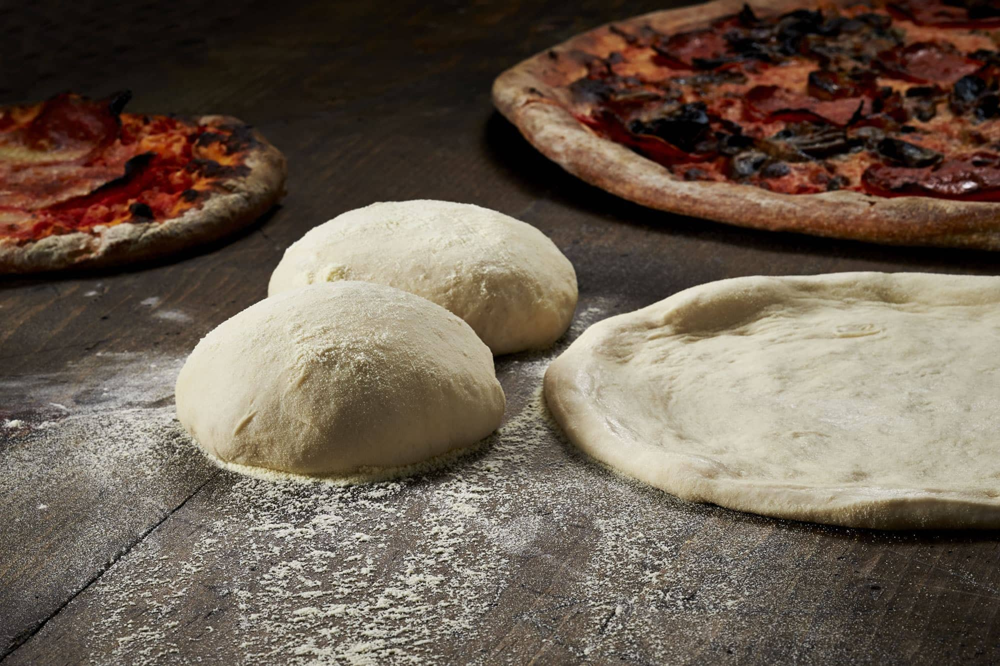

## Pizza oven dough

Standard dough for use in a wood fired pizza oven.

### Ingredients

- flour
- water
- salt
- yeast

### Method

1. place yeast in water
2. gradually add flour
3. add salt
4. knead for 20min for gluten to develop
5. rest for 6 hours
6. split into 6 individual dough balls. let rest for at least 60mins before making pizza
